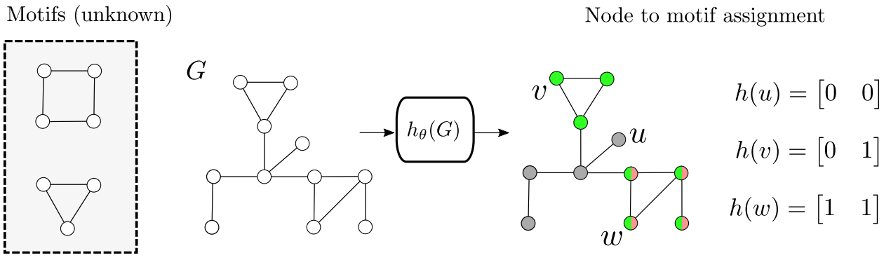

[][1]



# MotiFiesta: Neural Approximate Motif Mining
The repository implements the MotiFiesta algorithm described in the following paper:

>Carlos Oliver, Dexiong Chen, Vincent Mallet, Pericles Philippopoulos, Karsten Borgwardt.
[Approximate Network Motif Mining Via Graph Learning][1]. Preprint 2022.


MotiFiesta is a graph neural network trained to detect over-represented subgraphs in a graph dataset.


## Citation

```bibtex
@article{oliver2022approximate,
  title={Approximate Network Motif Mining Via Graph Learning},
  author={Oliver, Carlos and Chen, Dexiong and Mallet, Vincent and Philippopoulos, Pericles and Borgwardt, Karsten},
  journal={arXiv preprint arXiv:2206.01008},
  year={2022}
}
```

## Setup

```
$ pip install . 
```

## Build datasets

```
$ build_data_motifiesta 
```

## Untar pre-trained models

Download pretrained models [here](https://drive.proton.me/urls/BN2X8ZHQAR#UQFR3LELTwhj) and move the tarball to the root of this repository.

```
$ tar -xzvf models.tar.gz
```

## Training a model

```
$ motifiesta train -h
$ motifiesta train -da <dataset_id> -n test
```

## Making motif predictions

This is an example script for assigning each node in a graph to an integer motif ID using a pre-trained model.
You can also launch this with the command `$ motifiesta_example`

```python
from MotiFiesta.training.decode import HashDecoder

model_id = 'barbell-d0.00'
data_id = 'synth-distort-barbell-d0.00'
level = 3

decoder = HashDecoder(model_id, data_id, level)

decoded_graphs = decoder.decode()

for graph in decoded_graphs:
	print(f"Motif assignment for each node: {g.motif_pred}")
```

Scripts for generating figures in the paper are in `fig_scripts/`

Output from running [mfinder](https://www.weizmann.ac.il/mcb/UriAlon/sites/mcb.UriAlon/files/uploads/NetworkMotifsSW/mfinder/mfindermanual.pdf) are in `data_mfinder` and `out_mfinder`, the script `minder_benchmark.py` parses this output.


[1]: https://arxiv.org/abs/2206.01008
